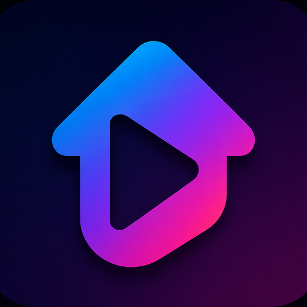

# Social Media Studio Pro



A production-ready Chrome Extension (Manifest V3) that gives content creators a single, professional dashboard to manage, schedule, and publish content to **Facebook**, **YouTube**, and **TikTok** — all through each platform's own **official API**.

> **Design principle:** this extension only ever acts on the Chrome profile/account you explicitly connect via OAuth. It never bypasses login, CAPTCHAs, rate limits, or platform protections, and it never simulates human behavior to evade detection. It is a content-management and publishing workflow tool, not an automation/bypass tool.

## Why this exists

Creators managing the same content across Facebook, YouTube, and TikTok end up repeating the same steps three times: re-uploading files, retyping titles/descriptions/tags, and manually tracking what's been published where. Social Media Studio Pro centralizes that workflow — bulk upload queues, reusable publishing profiles, scheduling, SEO helpers, optional AI-assisted copywriting, and a unified analytics view — while every actual publish action goes through the platform's sanctioned API using tokens you grant.

## Features

- **Unified dashboard** — sidebar navigation, light/dark/system theme, stat cards, live activity log, notifications.
- **Bulk upload queue** — drag & drop or folder import, auto-mapping of `video/image` files, `thumbnail.*`, subtitles, `description.txt`, `tags.txt`, `schedule.csv`, `metadata.json`; pause/resume/cancel/retry; priority ordering; duplicate detection.
- **Publishing profiles** — named presets (e.g. "Gaming", "Shorts", "Tutorials") that store default titles, tags, privacy, playlists, and more for reuse.
- **Scheduler** — schedule now or later, per-item time zone handling, recurring uploads (daily/weekly/monthly) via `chrome.alarms`.
- **Media tools** — client-side video/image preview and best-effort technical probing (duration, resolution, estimated FPS/bitrate, container/codec guess) with zero external dependencies.
- **SEO tools** — offline character counters, keyword/hashtag extraction, and a heuristic SEO score — no API key required.
- **AI tools (optional)** — pluggable, OpenAI-compatible title/description/tag/hashtag/hook/caption generators and content analysis, using an API key **you** provide in Settings.
- **Analytics** — pulls real performance data from each platform's official API (YouTube Data/Analytics API, Facebook Graph API insights) and charts it locally.
- **Local-first storage** — IndexedDB for history/profiles/templates/logs/analytics, `chrome.storage` for settings, and AES-GCM encryption at rest for OAuth tokens. No telemetry, no third-party data collection.

## Tech stack

Manifest V3 · TypeScript · React 18 · Vite 6 · Dexie (IndexedDB) · Zustand · Recharts · Chrome Tabs/Identity/Downloads/Notifications/Alarms/Side Panel APIs · Node.js/Express (optional local helper server for OAuth exchanges that require a confidential client secret).

## Related project: desktop app

Prefer a standalone Windows/macOS/Linux desktop app over a Chrome extension? See [`desktop-app/`](desktop-app/README.md) — an Electron dashboard focused specifically on posting one video to multiple TikTok accounts you own, built the same compliant way (TikTok's official Content Posting API, OAuth per account, no bundled credentials). It ships with a GitHub Actions workflow that builds a Windows installer/portable `.exe` (see [`.github/workflows/build-desktop-app.yml`](.github/workflows/build-desktop-app.yml)).

## Quick start

```bash
npm install
npm run build
```

Then in Chrome: `chrome://extensions` → enable **Developer mode** → **Load unpacked** → select the generated `dist/` folder.

See **[docs/INSTALLATION.md](docs/INSTALLATION.md)** for the full walkthrough and **[docs/API_SETUP.md](docs/API_SETUP.md)** to register your own Google/Facebook/TikTok apps so publishing actually works (the extension ships with no bundled credentials by design — you must configure your own).

## Documentation

| Doc | Purpose |
| --- | --- |
| [docs/INSTALLATION.md](docs/INSTALLATION.md) | Loading the unpacked extension in Chrome |
| [docs/BUILD.md](docs/BUILD.md) | Build system, scripts, and production packaging |
| [docs/API_SETUP.md](docs/API_SETUP.md) | Registering Google/Facebook/TikTok developer apps and the optional helper server |
| [docs/ARCHITECTURE.md](docs/ARCHITECTURE.md) | Codebase structure, data flow, and design decisions |
| [docs/DEVELOPER_GUIDE.md](docs/DEVELOPER_GUIDE.md) | Extending the extension: adding a platform, a page, a generator |

## Project structure

```
social-media-studio-pro/
├── public/                  # manifest.json, icons, _locales (copied verbatim to dist/)
├── src/
│   ├── background/          # Service worker: upload queue, scheduler, platform adapters
│   │   ├── platforms/        youtube/ facebook/ tiktok/ (+ shared OAuth helpers, adapter interface)
│   │   ├── uploadEngine/      queue engine, task factory, blob cleanup
│   │   ├── scheduler/         chrome.alarms wiring, recurrence
│   │   └── notifications/     chrome.notifications wrapper
│   ├── content-scripts/     # Read-only account detector (informational only)
│   ├── shared/               types, constants, IndexedDB (Dexie) schema + repositories,
│   │                         security (crypto/token vault), utils (SEO, AI client, media probe,
│   │                         folder-import mapping, CSV parsing, date/timezone helpers)
│   ├── ui/                   Shared React dashboard: components, pages, hooks, state, styles
│   ├── sidepanel/, popup/, options/   Entry points for each extension surface
├── server/                  # Optional Node/Express helper server (OAuth token exchange)
├── scripts/                  Build helpers (content script bundling, packaging, icon generation)
└── docs/                    Documentation + generated logo/screenshots
```

## Legal & platform compliance

This project is a client for official, documented platform APIs (YouTube Data/Analytics API, Facebook Graph API, TikTok Content Posting API). You are responsible for:

- Registering your own developer applications and complying with each platform's Developer Terms and API usage policies.
- TikTok's Content Posting API requires an approved, audited app for public posting; unaudited apps can only post to the developer's own sandboxed account. See [docs/API_SETUP.md](docs/API_SETUP.md).
- Not using this tool to violate any platform's Terms of Service, spam policies, or applicable law.

## License

MIT — see [LICENSE](LICENSE).
